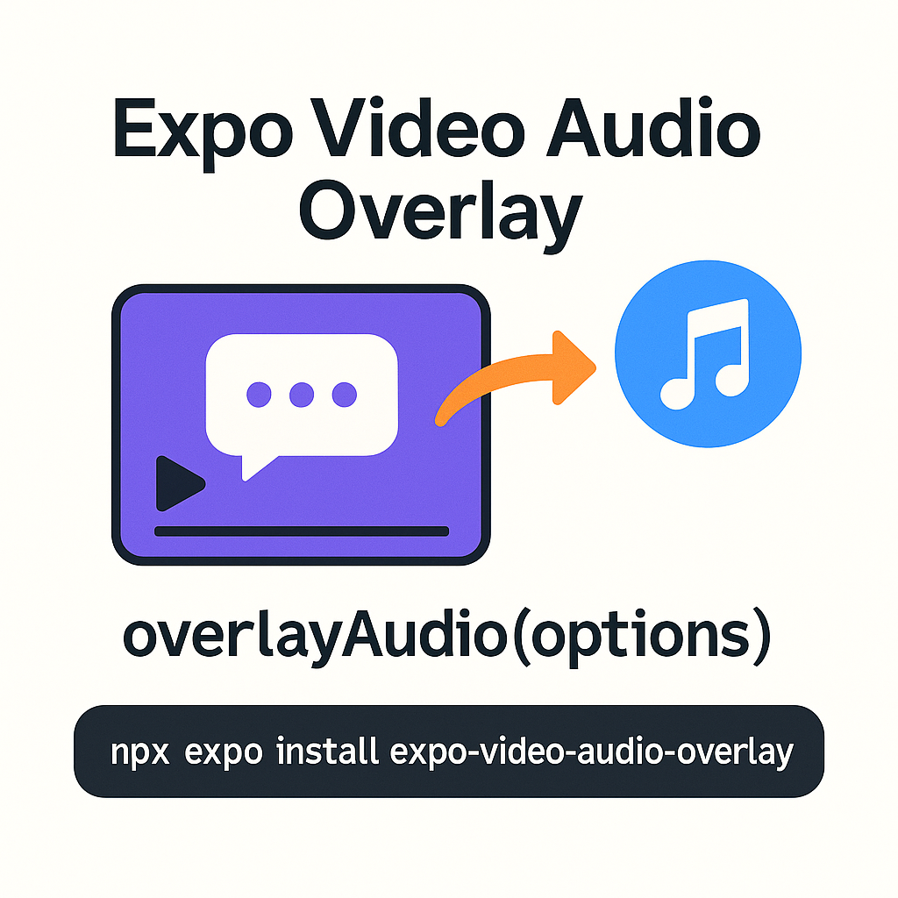

# Expo Video Audio Overlay

[](https://badge.fury.io/js/expo-video-audio-overlay) [](LICENSE)

**On‑device video + audio overlay for React‑Native & Expo**

*No FFmpeg • No GPL • Just the platform media APIs — `AVMutableComposition` (iOS) & `MediaMuxer` (Android)*

<table>
  <tr>
    <td>
      
    </td>
  </tr>
</table>

## Table of Contents

- [Expo Video Audio Overlay](#expo-video-audio-overlay)
  - [Table of Contents](#table-of-contents)
  - [Features](#features)
  - [Installation](#installation)
  - [Usage](#usage)
    - [API](#api)
  - [Troubleshooting](#troubleshooting)
  - [Contributing](#contributing)
  - [License](#license)

## Features

* **Offline** – runs entirely on‑device, no upload required
* **Flexible audio mixing** – loop, offset, volume & original‑track mix modes (mix / replace / mute)
* **MP4 / MOV output** – choose container & codec explicitly when needed
* **Expo‑friendly** – ships with a config‑plugin; just add it to `app.json`
* **Classic & New Architecture** – works if the host app opts into TurboModule/Fabric later

## Installation

> **Supported React‑Native versions:** 0.79 (Expo SDK 53). Older versions may compile but are not tested.

```bash
npx expo install expo-video-audio-overlay
```

That’s it — run a development build or EAS production build and the native module is ready.

> **Local testing:** run `npx expo run:ios` or `npx expo run:android` after installing the library; Expo Go will **not** include the native code.

## Usage

```ts
import { overlayAudio } from 'expo-video-audio-overlay';
import * as FileSystem from 'expo-file-system';

const videoUri = FileSystem.cacheDirectory + 'screen-recording.mp4';
const audioUri = FileSystem.bundleDirectory + 'music/background.mp3';

const outputUri = await overlayAudio({
  // Required
  video:  videoUri,
  audio:  audioUri,
  output: FileSystem.documentDirectory + 'share-video.mp4',

  // Optional controls ↓
  loop: true,                // repeat audio to match video length (default: true)
  audioStartOffset: 1,       // start audio 1 s after video begins (default: 0)
  volume: 0.8,               // 80 % volume (default: 1)
  originalAudio: 'mute',     // mute any soundtrack in the source video (default: 'mix')
  container: 'mp4',          // output container (mp4 or mov; platform default if omitted)
});

console.log('Video with sound saved at', outputUri);
```

### API

| Option             | Type                                | Default    | Description                                                                               |
| ------------------ | ----------------------------------- | ---------- | ----------------------------------------------------------------------------------------- |
| `video`            | `string`                            | —          | Absolute/local URI to the **input video**                                                 |
| `audio`            | `string`                            | —          | Absolute/local URI to the **audio** file to overlay                                       |
| `output`           | `string`                            | —          | Absolute path for the **output video** (overwritten if already exists)                    |
| `loop`             | `boolean`                           | `true`     | Loop the audio until its length meets/exceeds the video, then trim to match exactly       |
| `audioStartOffset` | `number` (seconds; can be negative) | `0`        | Offset where the audio starts relative to the video start. Negative delays the audio      |
| `volume`           | `number` (`0‒1`)                    | `1`        | Linear gain applied to the overlay audio track                                            |
| `originalAudio`    | `'mix' \| 'replace' \| 'mute'`      | `mix`      | How to treat any soundtrack already present in the video                                  |
| `container`        | `'mp4' \| 'mov'`                    | *platform* | Explicitly set the output container/codec (falls back to the platform default if omitted) |

**Returns:** `Promise<string>` — absolute file URI of the saved video.

> ⚠️ The module does **not** down‑mix or re‑sample audio; ensure your track uses a sample rate & codec accepted by the device encoder (e.g. AAC 48 kHz).

## Troubleshooting

| Problem                        | Fix                                                                                                 |
| ------------------------------ | --------------------------------------------------------------------------------------------------- |
| **`Native module not linked`** | Rebuild the dev client (`eas build --profile development`) or run `npx expo run-android / run-ios`. |
| **Audio not looping**          | Verify `loop` is `true`; ensure the audio file is a supported codec (AAC/MP3).                      |
| **iOS < 12 crash**             | The podspec targets iOS 12+. Older OS versions are not supported.                                   |

## Contributing

PRs are welcome! See [CONTRIBUTING.md](CONTRIBUTING.md) for details.

## License

MIT © 2025 Elliot Fleming
See [LICENSE](LICENSE) for details.
